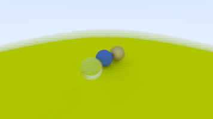

# Ray Tracer

This is a raytracer made from [Ray Tracing in One Weekend ](https://raytracing.github.io/books/RayTracingInOneWeekend.html) 
that uses the [deal](https://deal.readthedocs.io/index.html) python library to design by contract and catch errors.

## Render

